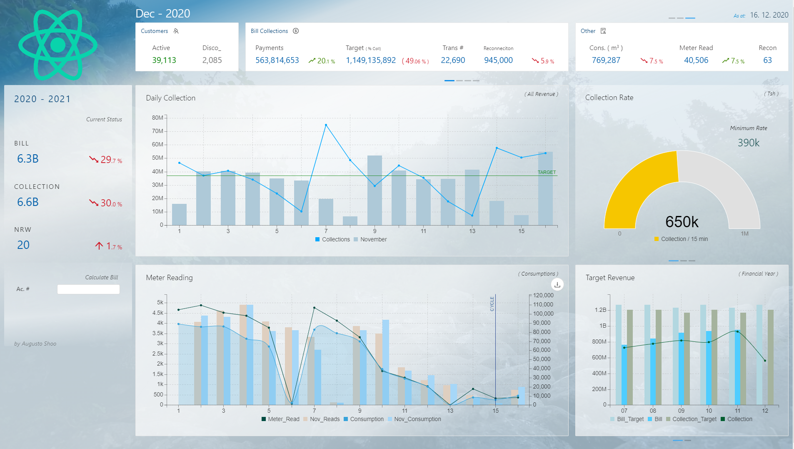
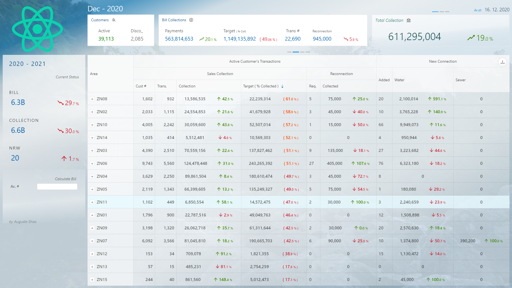
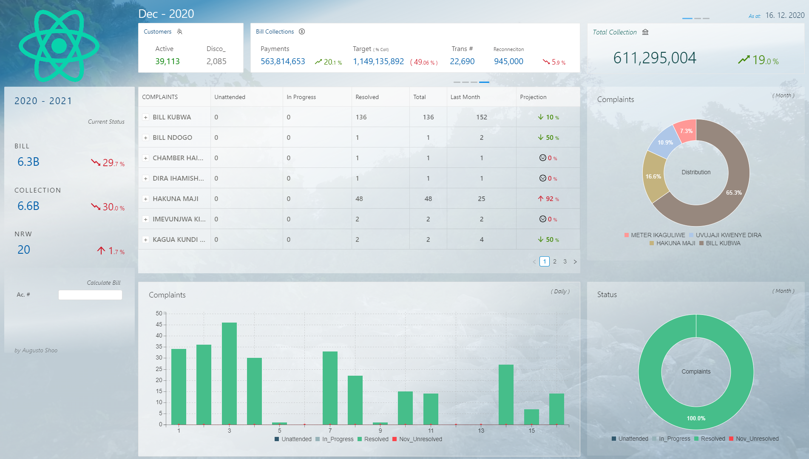

# Full Stack Dashboard Seed

This is for your inspiration to get started on your next **NodeJS Full Stack** project or learn some principles behind it.

The project is tailored for _Water Supply Organization's_ data sets.

The app uses variety of active technologies to accomplish the task:

- ReactJS, React Saga, Redux store and Ant-Design for Frontend development
- NodeJS (ExpressJS) as Backend framework
- MS SQL server for database
- Redis for cache services

> Live [heroku demo preview](https://guarded-basin-50558.herokuapp.com/) code is on the master branch

On backend's [index.js](backend/index.js)

```javascript
// Replace redis URL with your own
const publisher = redis.createClient("here");
...

/* When no database connection is availble use "sample" as data set
    otherwise make sure your database is online and query statements are updated accordingly */
global.dataMode = "db";
```

For MS Sql Server database connection configurations, [set them here](backend/models/index.js)

```javascript
const sqlDB = new SqlRepo({
  user: "john",
  password: "doe",
  server: "localhost",
  database: "your_db",
  connectionTimeout: 3500,
  requestTimeout: 250000,
  pool: { max: 2, min: 1, idleTimeoutMillis: 70000 },
  options: { encrypt: false },
});
```

### Happy coding! :tada:

<br/>

Section 1
<a href="https://guarded-basin-50558.herokuapp.com/">

</a>

Section 2
<a href="https://guarded-basin-50558.herokuapp.com/">

</a>

Section 3
<a href="https://guarded-basin-50558.herokuapp.com/">

</a>

<p align="left">
<a href="https://www.buymeacoffee.com/paldron" target="_blank"></a>
</p>
